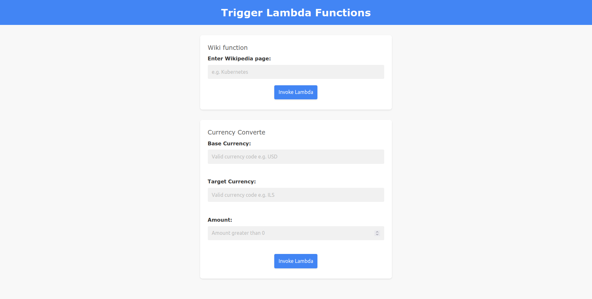

# Static Website with Lambda Triggers using AWS S3

This project involves a static website hosted on AWS S3 that triggers Python-based AWS Lambda functions. A Jenkins pipeline is implemented for testing and deploying the appropriate function based on the pushed branch.

## Static Website Hosting:
You have a static website hosted in an AWS S3 bucket. This bucket is configured to serve static web content, such as HTML, CSS, JavaScript, images, and other assets. When users access the website through its S3 endpoint, they can view the web content.

## Lambda Triggers:
The static website hosted in S3 is configured to trigger AWS Lambda functions upon certain events, such as object creation, deletion, or updates in the S3 bucket. These Lambda functions are designed to perform specific tasks in response to these events.
Jenkins Pipeline for Testing and Deployment

## Jenkins Pipeline:
You have set up a Jenkins pipeline to automate the testing and deployment process for your AWS Lambda functions. The pipeline is configured to build, test, and deploy the Lambda functions whenever code changes are pushed to specific branches (e.g., feature branches, develop, master, etc.).

## Branch-Based Deployment:
The Jenkins pipeline uses branch-specific logic to determine which Lambda function to deploy based on the branch where the code push occurred. This ensures that the correct version of the Lambda function is deployed to the appropriate environment (e.g., development, staging, production) based on the branch.
Lambda Functions

## currency_converter Lambda Function:
This Lambda function serves as an AWS Lambda event handler. It is designed to convert currency using an external API. The function takes input parameters (base currency, target currency, and amount), requests an exchange rate API, performs the conversion, and returns the conversion result.

## get_info Lambda Function:
This Lambda function interacts with the Wikipedia API. It fetches a summary of a requested topic and stores the summary in an Amazon S3 bucket. The function is triggered by an event (possibly containing the requested topic) and uses the wikipediaapi library to retrieve the topic summary and the boto3 library to upload the summary to an S3 bucket.

## Badges

